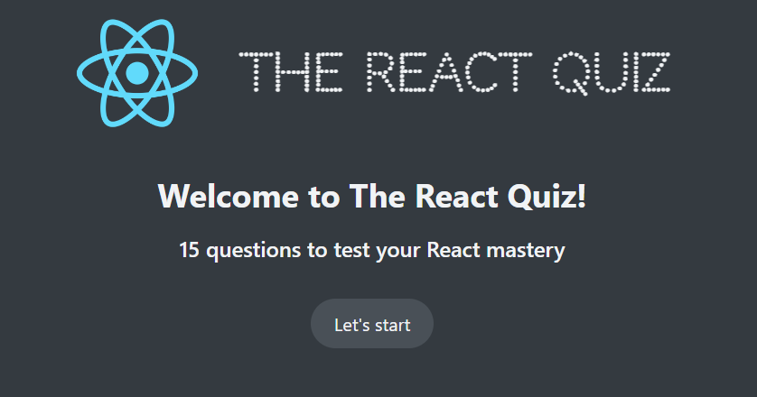
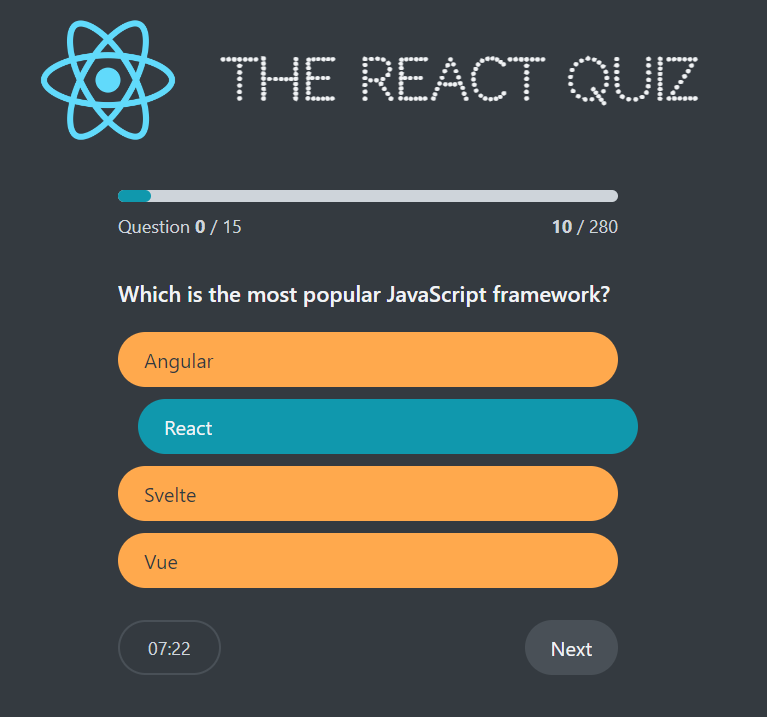
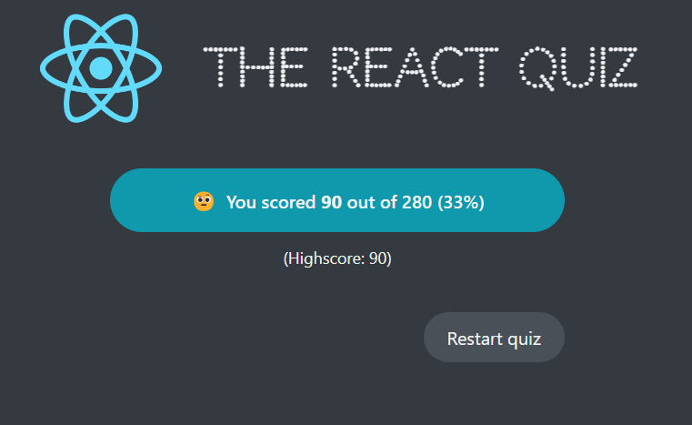

# Quiz App

This is a simple Quiz app that contains 15 questions about Programing. It contains Timer also. At the and of the quiz, user needs to restart the app.
App shows actual progress with the questions and no of points earned, depends on how the question is answered - true or false.

If the answer is correct showing :

At the and of quiz, user gets option to Restart the quiz and start again.

This App is build to practice useReducer and React in general and managing state. Ofcourse, it needs many improvments...
